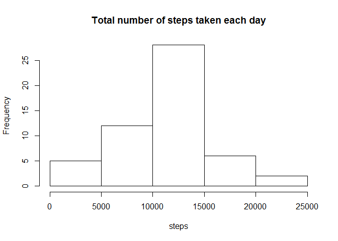
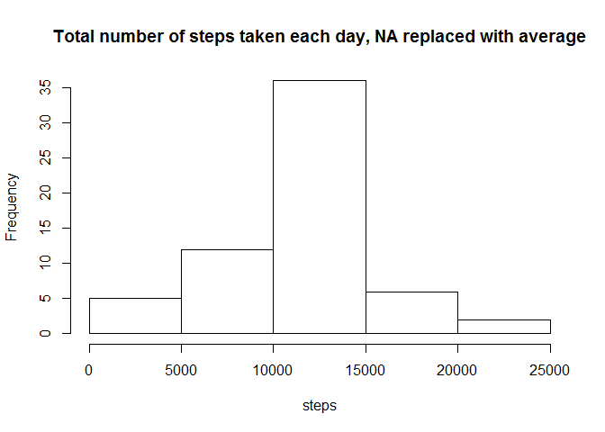
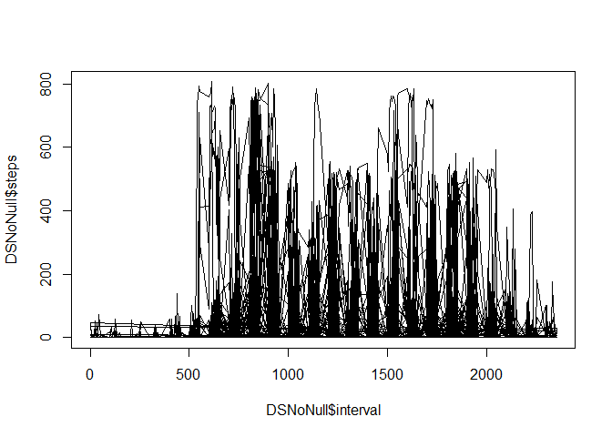

# PeerProcessing1
HG  
12 November 2015  

##Loading and preprocessing the data

*For the first part I just make summary of steps per day*


```r
    setwd ("C:/Users/hila_000/Documents/MarkDown")
    DSActivity <- read.csv("activity.csv")
```


## What is mean total number of steps taken per day?


For this part of the assignment, you can ignore the missing values in the dataset.

Make a histogram of the total number of steps taken each day

Calculate and report the mean and median total number of steps taken per day


```r
    library(data.table)
```

```
## Warning: package 'data.table' was built under R version 3.1.3
```

```r
    df <- aggregate(steps ~ date, DSActivity, sum)
    head (df)
```

```
##         date steps
## 1 2012-10-02   126
## 2 2012-10-03 11352
## 3 2012-10-04 12116
## 4 2012-10-05 13294
## 5 2012-10-06 15420
## 6 2012-10-07 11015
```

```r
    hist (df$steps, main = 'Total number of steps taken each day', xlab = "steps")
```

 
  
  
The mean total number of steps taken  per day is 1.0766\times 10^{4}
The median total number of steps taken each day is 10765

## What is the average daily activity pattern?

Make a time series plot (i.e. type = "l") of the 5-minute interval (x-axis) and the average number of steps taken, averaged across all days (y-axis)


```r
    df2 <- aggregate(steps ~ interval, DSActivity, mean)
    plot (df2, type = "l")
```

 
  
  
Which 5-minute interval, on average across all the days in the dataset, contains the maximum number of steps?  

That happens at interval 104 with the value of 206.1698113 steps


## Imputing missing values

Note that there are a number of days/intervals where there are missing values (coded as NA). The presence of missing days may introduce bias into some calculations or summaries of the data.

Calculate and report the total number of missing values in the dataset (i.e. the total number of rows with NAs)  

**The total number of missing values in the dataset is 2304**

Devise a strategy for filling in all of the missing values in the dataset. The strategy does not need to be sophisticated. 
** I've decided to use the the mean for that 5-minute interval**

Create a new dataset that is equal to the original dataset but with the missing data filled in.


```r
    DSNoNull <- DSActivity
    
    for (i in 1:nrow(DSNoNull))
      {
        if (is.na(DSNoNull[i, "steps"])==TRUE)
          {
              x <- df2[df2$interval== DSNoNull[i, "interval"], "steps"]
              
              DSNoNull[i, "steps"] <- x
          }
      }
```

Make a histogram of the total number of steps taken each day  


```r
  dfPerDay2 <- aggregate(steps ~ date, DSNoNull, sum)
  
  hist (dfPerDay2$steps, main = 'Total number of steps taken each day, NA replaced with average',
        xlab = "steps")
```

 
  

The new values in the dataset,  NA was replaced with an average taken per day, are: 
The mean total number of steps is 1.0766189\times 10^{4}  

The median total number of steps taken each day is 1.0766189\times 10^{4} 

The original numbers are : 1.0766\times 10^{4} for the mean and 10765 for the median, so since I replaced the mean with a mean, the difference is negligble

  
 
## Are there differences in activity patterns between weekdays and weekends?

For this part the weekdays() function may be of some help here. Use the dataset with the filled-in missing values for this part.
**I've added the weekday using a different function, and created the factors a bit differently**

Create a new factor variable in the dataset with two levels -- "weekday" and "weekend" indicating whether a given date is a weekday or weekend day.

Make a panel plot containing a time series plot (i.e. type = "l") of the 5-minute interval (x-axis) and the average number of steps taken, averaged across all weekday days or weekend days (y-axis). 


```r
    newCol = lapply (as.POSIXlt(DSNoNull$date)$wday %% 6 == 0 , factor, 
                         levels= c (TRUE, FALSE), labels = c("weekend","weekdays"))
                         
    DSNoNull$WhichDay <- newCol
```

**I am very sorry but I couldn't produce the plot by factors**

```r
    plot (DSNoNull$interval, DSNoNull$steps,  type = "l")
```

 
